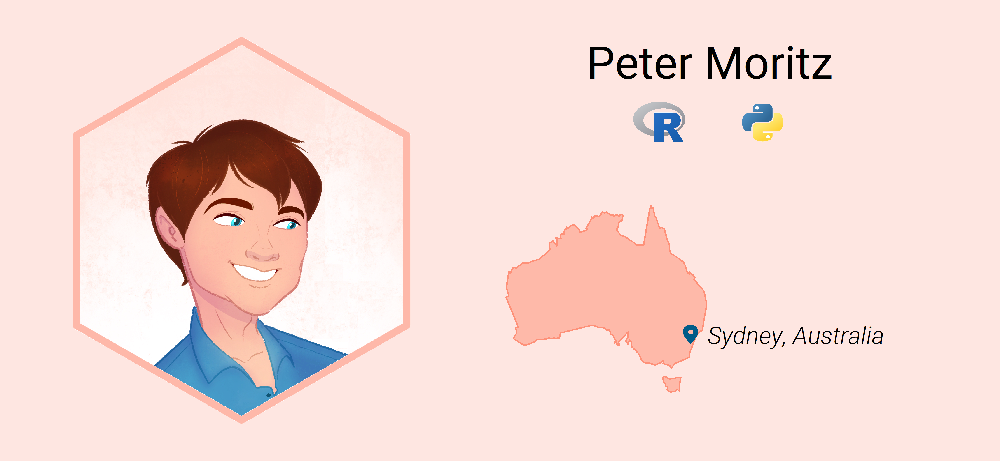

 
 
[![](https://img.shields.io/badge/-WoS%20Researcher%20Profile-786BAA?logo=data%3Aimage%2Fpng%3Bbase64%2CiVBORw0KGgoAAAANSUhEUgAAAHAAAAB%2BCAYAAAD86pU7AAAIPklEQVR42u3cA5AkSQCF4RytbZ9t27Zt27Zt27ZtY23bNmZ7p9%2F9EXF3q5lpTHVWZVW%2BiC8ufLv7oqqzUsb1nNla9XAw6hkfJwt8GsI8fIgTsSqKjE%2FkyzsIaagSg3ADtkCp8Ylcea0xGcrCRNyDrX2Z0SnwGygP43ADNvGv2fDKOx0KQFecgCbGWnx5bTEDCtACPI6N%2FFNZ%2BAI%2FgwroTxyFWibw%2BPIOhiwZg7PQyPgE9sE%2BCrJsFq5EC99CzQq8FwrRPFyPDr6N3MtbEfOgCCjHFWjsm8m%2BwA%2BhiJmGM1HHN1R9eZsjDUXUUOxX9eeHL%2FBXyAHfYnPf2NLl7QY5JI278O%2Fvoy%2FwT8hBE3AgivzT57b30D6pBf4OxcBsHIuSJJW3FRQzv6GNn7B22zQcEPfyOiEFxdjjaBDXAh%2BHEqAP1opbebUxBUqIBTgaRXEp8DQogd4Oek61CC2wFrbFPjgap%2BMq3IF78RReXMKjuBe34iqcjqOwN7bE6mhaTYF%2FQAn1a5Cj1FFQAc1FD7yJa3H4GnVP3OXfpRol2ARsVNPyNoRCcAd%2F%2BFrYAhfiTfRBCkqQFA6pSYE3QyHYuIrXagPsh8fQLUGFXonifAr8EbJsBIqyHOg0wgl4D5OhGHs810M7pZgNWXZtnqPWIuyMlzAeiqHfUN9kme2hEGwU0GfInngHs6AY%2BRFNTRa5HbJsPIoD%2Fp6si7PRBWkoBrqglcmQbyHL7ivw5MBGeANzIcf1R2tTTSZBlu1qaZanOe7GZPdLrHxv6iqQZSk0CmG%2B9SoMgxw1srIn8RTIsu9CnHctxVUY7%2FCTuLJZIs9Cll0UkRWQWzADcsxgs0R%2BgyzbKkIrIU3xnGPzsW%2BGOYBJoX4El7TWw%2BdQxFVgA%2FNvWkOW%2FRbxtckTMRGKqJfNEtkbsuxWBxaYG%2BEVLIKihadviVwLWXagQzsF9sBoKCI%2BMsvkNciyNRzb7tEAr6ECCtlyS28%2FQxaVo8zhLf%2FTIvP0%2FZvhkEWdY7B3tTNkWRobVraBaQFk0VMx2EFXhMcsv1JfM5WkA2TZWTHay3ocZkMFthCrmEqyI2TZ3jHbkLyhhVHqbaaKnARZtm4MjwS0wFdQAUyp7j636yDLmsf0XEcJPoACdoypJk9CFs1HcYxPVzXH80hDARicaVPT25BFAxNwvrEB7glghJpCxhmrr2O7iBv%2BOuMNSEF5eiCbzb1%2FQha9mKCj4mW4Ks8SB2Z7wV5fyKI7YBJYYnmOr86sN3uNDGMbRQJLPC2HJ%2FHeLF6doa3EnwiTwBJLcGMWA5vOud7hPQuy6HAkMv8ObO5DGqrETGxicsxCyKL9YRJ%2B8%2FBLUCVON3lElu0Jk%2FASm1Qy7fYMarlQ4I4wvkS1Q3cIg5DX9KIvMPwtjJ2xjSGOFejT7vfS5qu%2Bv%2Fq3%2FLeTewX68mrhfQjfoJY7BfryivAQKiCkcbkrBe5hfIFXoxxawmzsZEjUvwP3S3h5p2MuVIlBaG%2BIn4mJZnlHYyZUjXdRanLIZD8XaqW8HTAVyqACpxniVyOiU97BGANlaQrWMiSK64G3JbC8KVCOvkdWV1D%2BBVn0QoLKOzK%2F8gBktQH6G8iirxNS3qmYAdXAFGxqMuRdvyst8I%2F0KzAHCsAvKInSvtB5KI5peaW4D%2FOhgFRgH1NNboAsaxHHiWk8jhQUsP6o8kKkEyDL1o9ZeWvhJ6ShArnEVJEdIMv2iVF5%2B2AgVGBT0DEq5wPPjcnv3ZWYClnykKkkJZgPWfS04%2BW1x2sohyyaizVNJRkGWdTV4fK2QjcoJM%2BbSvJLCEfM6jhWXEPcivFQiOZXNk%2F6KmTZWg6VtzW%2BwyIIQISewqshyw52oLjGuBkToAiZj9XDvivtjoiXtx9%2BDf%2Bpy25E2hppyKI%2FI1rcmngIM6AIm43VwzylVI5GEZsKuxZDIUc8aZbIr5Bl20SguHo4A52xCHJIX7NEnoEsuyzkjbXH4yeUQ44Zip3DvvDnpxCKq4%2Fj8QXmQw4ag83MMlkJsqwczSwV1xLn4FdniwOGYltTSYowIW47tfnLrotb0BMpyPHyNo3O%2Fhjg4QKU1gCH4jWMQhpyXJ9s9sfcClk2FrUCKK0E2%2BJ2dMZcKCY6I6sLAreFQrBpnqWVYStchx8wCYqZ7ljZZJlamAFZdkuOH9z74k78gglIQzH0Nigvt%2FwAWTYcpVUU1hQ74mK8iT6YBcVYGg%2BjickjN0Ih2PzfwcdGOAI34330wRSkoQRYgEtR1%2BSZ9S28RiejN77E07i22T0l1%2Fw71B%2BLBVACTcQRKDU1SDHWxQ44EVfjEbyFr9EFPdELAzBwCf3QCz3QBV%2FhDTyAy3E0tsZa6IgmKF7ie60CSqhx2BVFxkLKUAsN0HAJ9VALpXmOKrtACdQXq8Rhj%2BV5UIKk8CRaxGWTbANMgxJgKk5AadzOGDwHhS%2F8mRVXC1wTKSiG5uNeNIr74civoJgZi91QnITTrbuiIkYf5s%2BgY9KuovobctwQ7I0Sk9CrOdKQg2bjQTQ3Sc2%2F63s9HJyE%2Fh2bL%2Flbl%2BQSD3ToKRyNi1HP%2BPxfYDH%2BgiJsOu5Ha99Y5SXuHNENt3PxLtbKPAHtS%2Fw8YvOX32ArlPp2sp%2BdmQeFqBw%2FYd%2F8rkf2JT4a4vTX99jRF1fzw5ZjIUtm4SNsgTLfQDAlHo8KCyvjr2Ctwsyg%2BM%2BKb6CALUQfnIN2xqegJa4c4OnZCXgL26G%2B8bFW4kVI1%2BC37Q%2Bcjw7%2BGy68a66%2Bz3FyuTuuwJp%2BUBKNElfC1Ax7Tv7GpVgLtY1P5Eo8AYsgLMAwvI8jsJJ%2F0txY%2BN0Qm2BdNDMJyz9kMo0Tv4SRNgAAAABJRU5ErkJggg%3D%3D)](https://www.webofscience.com/wos/author/record/IST-1945-2023)  
I'm a **passionate** and experienced health data specialist based in Sydney, Australia.

### Experience

* <!--RPythonExp-->15.4<!--END--> years in R/Python
* <!--HealthAnalysis-->8<!--END--> years in health data analysis/science
* <!--SurgDesign-->7.4<!--END--> years in surgical study design and biostatistics
* <!--AusHC-->11.5<!--END--> years experience in the Australian healthcare system

### Affiliations

* **Lead biostatistician** - Cancer Institute NSW
* **Unit coordinator** (Master of Surgery program) - University of Sydney
* **Biostatistical consultation** - ad hoc

### What I do in my spare time

:memo: Contribute to surgical research  
:chess_pawn: Board / video games  
:trophy: [Project Euler](https://projecteuler.net/) problems (wish I had more time to do them!)

Sometimes I lose track of all my personal projects so I use a kanban board to keep on top of it. See my board below to keep track of what is in my pipeline and find out what might be holding up progress on your issue. This is a replica of my private Trello board and is updated via an API every 3 days using GitHub Actions. The Done list is flushed every fortnight.

<!--TrelloBoard-->
**Personal board**
| To Do | Doing | Done |
| --- | --- | --- |
| University: Mark Module 1 | Personal: Project Euler: 100 | University: Prepare Semester 2 |
| Personal: Update Metro parking history | escapeRoom: Add tests |   |
| Personal: Create gameshow app |   |   |
| Publication: Data governance publication - data analysis |   |   |
| modulartabler: Implement linked table suppression |   |   |
| escapeRoom: Improve win/fail notifications |   |   |
| Personal: Build murder mystery group challenge |   |   |
| Personal: Code Poker team game |   |   |

*Last updated: 2025-08-16 21:32 AEST*
<!--END-->

### GitHub Projects

Across my two jobs and in my spare time contributing to surgical research, my personal projects tend to focus on non-data work for a bit of fun. Some of my projects include:

|  [__escapeRoom__](https://github.com/PeterM74/escapeRoom) | [ __BeastBot__](https://github.com/PeterM74/BeastBot) |
|:---:|:---:|
| [ __MicrosoftTeamsLight__](https://github.com/PeterM74/TeamsStatusLight) | [ __TallawongCarparkMonitor__](https://github.com/PeterM74/TallawongCarparkMonitor) |
| [modulartabler](https://github.com/inpowell/modulartabler)   *Collaborator* |  |
